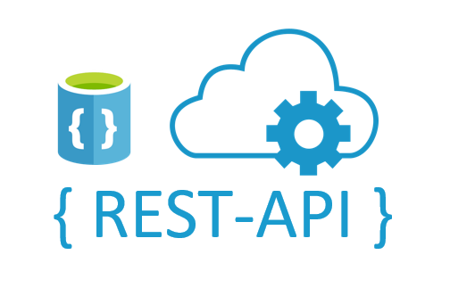
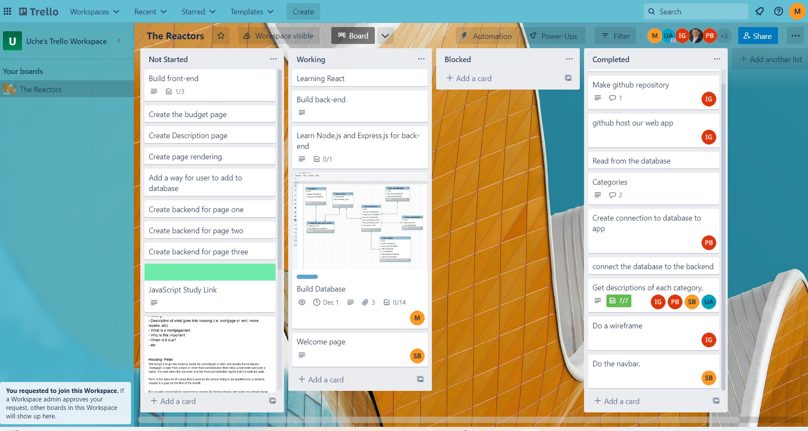
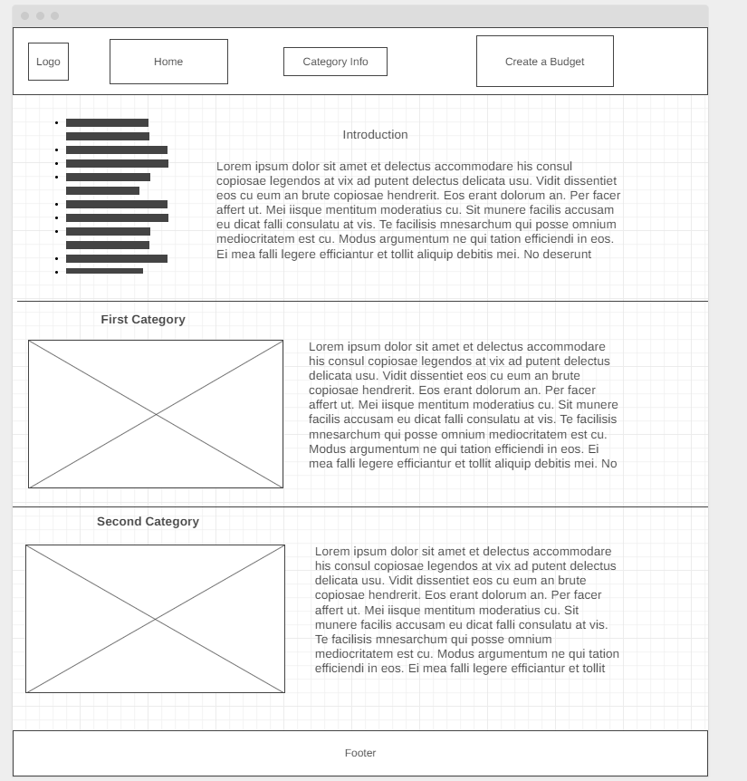
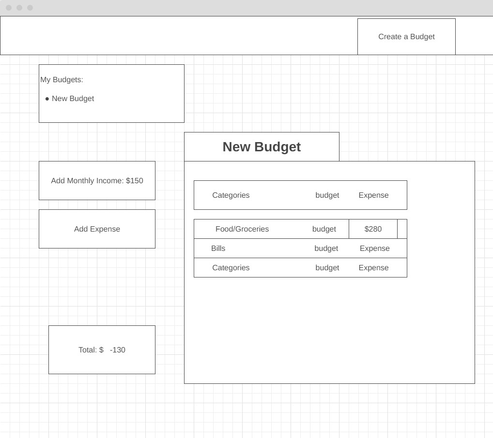
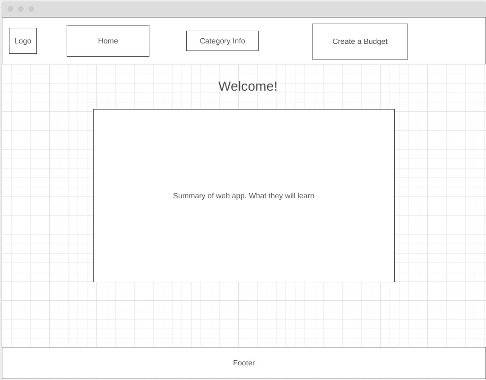
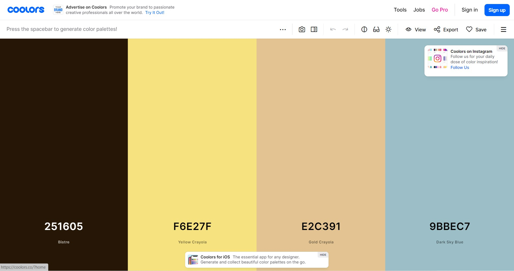
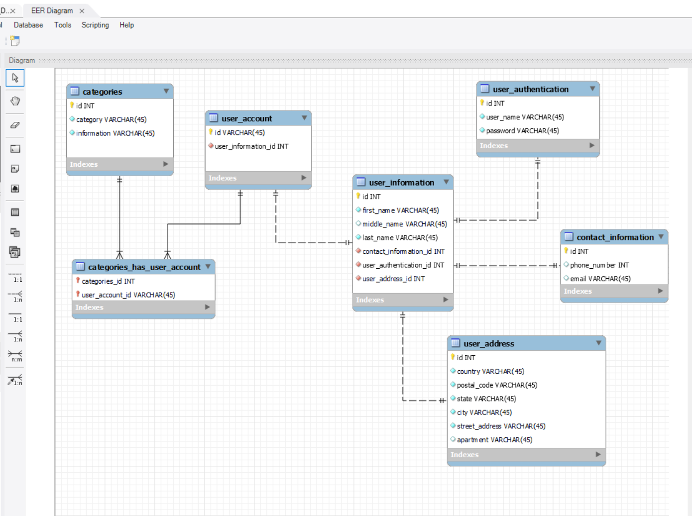
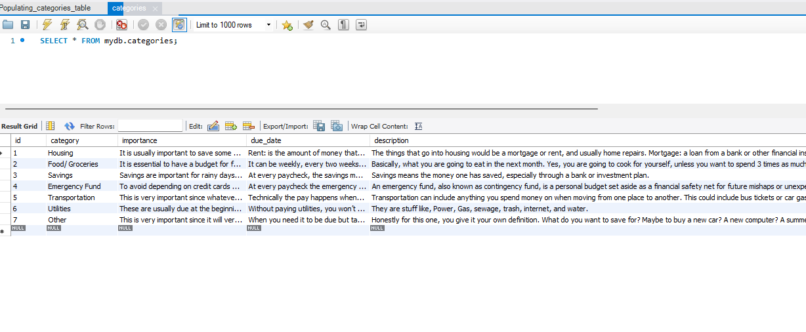

## Project Introduction - The Reactors

This technology is teaching how to budget (our project will be a budgeting web app) 
The software that we will be using are:
* MySQL for the database.
* React for the front end. 
* Node.js for the backend.  

It will be targeting more secondary students than 
elementary students. 

<b>Our project requirements: </b>

* Input your income expenses
* Choose of what you want to budget for (i.e. differently categories to add to budget)
* When category chosen, teach the term that is associated with it
* Add an introduction on what a budget is
* Use REST API to connect backend and frontend

### Team Members
* Benson, Peter (Team Leader)
* Varela, Marco (Quality Assurance and Documentation Manager)
* Mar Garcia, Isai (Configuration Manager)
* Ajike, Uche (Project Manager)
* Vega Bonilla, Shannon (Graphic Designer)


### Technologies
 
SQL (for our database)   |  MySQL Workbench (DBMS)  |  Visual Studio Code      |  NodeJS                  |                
:-----------------------:|:-----------------------: |:-----------------------: |:-----------------------: |
 |  | |  |

React                    |  ExpressJS               |  CSS & HTML              |  REST IP's               |  
:-----------------------:|:-----------------------: |:-----------------------: |:------------------------: |
 |  || |

### Project Management Tools

We are using a Trello board and Microsoft Teams as our project management tools
[Click here to see our Trello board ](https://trello.com/b/Ox0J9FpU/the-reactors)
Here is a screenshot of our board (11/07/2022)




### Wireframes

Categories page (Wireframe)



Budgeting page (Wireframe)



Homepage (Wireframe)



### Content Format
<b> Logo: </b>


<b> Fonts and icons: </b> [click here](https://fontawesome.com/icons/coins?s=solid&f=classic)


<b> Color Palette: </b> [Click here](https://coolors.co/251605-f6e27f-e2c391-9bbec7)



### Database
For our database we decided to use a relational database, so will be using SQL and MySQL as our DBMS, "Database Management System".

This is how our diagram looks like:


This is how the categories table looks like:


This script will create the schema:

```
-- MySQL Workbench Forward Engineering

SET @OLD_UNIQUE_CHECKS=@@UNIQUE_CHECKS, UNIQUE_CHECKS=0;
SET @OLD_FOREIGN_KEY_CHECKS=@@FOREIGN_KEY_CHECKS, FOREIGN_KEY_CHECKS=0;
SET @OLD_SQL_MODE=@@SQL_MODE, SQL_MODE='ONLY_FULL_GROUP_BY,STRICT_TRANS_TABLES,NO_ZERO_IN_DATE,NO_ZERO_DATE,ERROR_FOR_DIVISION_BY_ZERO,NO_ENGINE_SUBSTITUTION';

-- -----------------------------------------------------
-- Schema mydb
-- -----------------------------------------------------

-- -----------------------------------------------------
-- Schema mydb
-- -----------------------------------------------------
CREATE SCHEMA IF NOT EXISTS `mydb` DEFAULT CHARACTER SET utf8 ;
USE `mydb` ;

-- -----------------------------------------------------
-- Table `mydb`.`categories`
-- -----------------------------------------------------
CREATE TABLE IF NOT EXISTS `mydb`.`categories` (
  `id` INT NOT NULL,
  `category` VARCHAR(1000) NULL DEFAULT NULL,
  `importance` VARCHAR(1000) NULL DEFAULT NULL,
  `due_date` VARCHAR(1000) NULL DEFAULT NULL,
  `description` VARCHAR(3000) NULL DEFAULT NULL,
  `Budget` FLOAT NULL DEFAULT NULL,
  PRIMARY KEY (`id`))
ENGINE = InnoDB
DEFAULT CHARACTER SET = utf8mb3;


-- -----------------------------------------------------
-- Table `mydb`.`contact_information`
-- -----------------------------------------------------
CREATE TABLE IF NOT EXISTS `mydb`.`contact_information` (
  `id` INT NOT NULL,
  `phone_number` INT NULL DEFAULT NULL,
  `email` VARCHAR(45) NULL DEFAULT NULL,
  PRIMARY KEY (`id`))
ENGINE = InnoDB
DEFAULT CHARACTER SET = utf8mb3;


-- -----------------------------------------------------
-- Table `mydb`.`user_address`
-- -----------------------------------------------------
CREATE TABLE IF NOT EXISTS `mydb`.`user_address` (
  `id` INT NOT NULL,
  `country` VARCHAR(45) NOT NULL,
  `postal_code` VARCHAR(45) NOT NULL,
  `state` VARCHAR(45) NOT NULL,
  `city` VARCHAR(45) NOT NULL,
  `street_address` VARCHAR(45) NOT NULL,
  `apartment` VARCHAR(45) NULL DEFAULT NULL,
  PRIMARY KEY (`id`))
ENGINE = InnoDB
DEFAULT CHARACTER SET = utf8mb3;


-- -----------------------------------------------------
-- Table `mydb`.`user_authentication`
-- -----------------------------------------------------
CREATE TABLE IF NOT EXISTS `mydb`.`user_authentication` (
  `id` INT NOT NULL,
  `user_name` VARCHAR(45) NOT NULL,
  `password` VARCHAR(45) NOT NULL,
  PRIMARY KEY (`id`))
ENGINE = InnoDB
DEFAULT CHARACTER SET = utf8mb3;


-- -----------------------------------------------------
-- Table `mydb`.`user_information`
-- -----------------------------------------------------
CREATE TABLE IF NOT EXISTS `mydb`.`user_information` (
  `id` INT NOT NULL,
  `first_name` VARCHAR(45) NOT NULL,
  `middle_name` VARCHAR(45) NULL DEFAULT NULL,
  `last_name` VARCHAR(45) NOT NULL,
  `user_authentication_id` INT NOT NULL,
  `contact_information_id` INT NOT NULL,
  `user_address_id` INT NOT NULL,
  PRIMARY KEY (`id`),
  INDEX `fk_user_information_user_authentication1_idx` (`user_authentication_id` ASC) VISIBLE,
  INDEX `fk_user_information_contact_information1_idx` (`contact_information_id` ASC) VISIBLE,
  INDEX `fk_user_information_user_address1_idx` (`user_address_id` ASC) VISIBLE,
  CONSTRAINT `fk_user_information_contact_information1`
    FOREIGN KEY (`contact_information_id`)
    REFERENCES `mydb`.`contact_information` (`id`),
  CONSTRAINT `fk_user_information_user_address1`
    FOREIGN KEY (`user_address_id`)
    REFERENCES `mydb`.`user_address` (`id`),
  CONSTRAINT `fk_user_information_user_authentication1`
    FOREIGN KEY (`user_authentication_id`)
    REFERENCES `mydb`.`user_authentication` (`id`))
ENGINE = InnoDB
DEFAULT CHARACTER SET = utf8mb3;


-- -----------------------------------------------------
-- Table `mydb`.`user_account`
-- -----------------------------------------------------
CREATE TABLE IF NOT EXISTS `mydb`.`user_account` (
  `id` VARCHAR(45) NOT NULL,
  `user_information_id` INT NOT NULL,
  PRIMARY KEY (`id`),
  INDEX `fk_user_account_user_information1_idx` (`user_information_id` ASC) VISIBLE,
  CONSTRAINT `fk_user_account_user_information1`
    FOREIGN KEY (`user_information_id`)
    REFERENCES `mydb`.`user_information` (`id`))
ENGINE = InnoDB
DEFAULT CHARACTER SET = utf8mb3;


-- -----------------------------------------------------
-- Table `mydb`.`user_account_has_categories`
-- -----------------------------------------------------
CREATE TABLE IF NOT EXISTS `mydb`.`user_account_has_categories` (
  `user_account_id` VARCHAR(45) NOT NULL,
  `categories_id` INT NOT NULL,
  PRIMARY KEY (`user_account_id`, `categories_id`),
  INDEX `fk_user_account_has_categories_categories1_idx` (`categories_id` ASC) VISIBLE,
  INDEX `fk_user_account_has_categories_user_account1_idx` (`user_account_id` ASC) VISIBLE,
  CONSTRAINT `fk_user_account_has_categories_categories1`
    FOREIGN KEY (`categories_id`)
    REFERENCES `mydb`.`categories` (`id`),
  CONSTRAINT `fk_user_account_has_categories_user_account1`
    FOREIGN KEY (`user_account_id`)
    REFERENCES `mydb`.`user_account` (`id`))
ENGINE = InnoDB
DEFAULT CHARACTER SET = utf8mb3;


SET SQL_MODE=@OLD_SQL_MODE;
SET FOREIGN_KEY_CHECKS=@OLD_FOREIGN_KEY_CHECKS;
SET UNIQUE_CHECKS=@OLD_UNIQUE_CHECKS;

```

These two following scripts will populate our database\
-Script 1
```
-- I am going to drop the categoy column to create a new one with a bigger VARCHAR datatype limit
use mydb;
ALTER TABLE categories
DROP COLUMN category;


-- I am going to drop the info column to create new ones
use mydb;
ALTER TABLE categories
DROP COLUMN information;


-- Creating a new and updated category table


ALTER TABLE categories
ADD category VARCHAR(1000);


-- Creating new columns for the categories table


ALTER TABLE categories
ADD importance VARCHAR(1000);


ALTER TABLE categories
ADD due_date VARCHAR(1000);


ALTER TABLE categories
ADD description VARCHAR(3000);


-- This script will populate the category table


INSERT INTO `mydb`.`categories` (`id`, `category`, `importance`, `due_date`, `description`) VALUES ('1', 'Housing', 'It is usually important to save some money for home repairs because you never know when something will break or just run down. An example of a home repair would be a bathroom remodel or fixing your kitchen sink. ', 'Rent: is the amount of money that is paid by the person living in an apartment to a landlord. Usually it is paid on the first of the month.', 'The things that go into housing would be a mortgage or rent, and usually home repairs. Mortgage: a loan from a bank or other financial institution that helps a borrower purchase a home. It is paid when the borrower and the financial institution agree that it should be paid.');
INSERT INTO `mydb`.`categories` (`id`, `category`, `importance`, `due_date`, `description`) VALUES ('2', 'Food/ Groceries', 'It is essential to have a budget for food, our health depends on this', 'It can be weekly, every two weeks or monthly', 'Basically, what you are going to eat in the next month. Yes, you are going to cook for yourself, unless you want to spend 3 times as much money eating out (who can afford that?). There’s different ways to budget for this, here are some suggestions: Plan your meals first and then make a grocery list of what ingredients you will need to cook. You can also add here everything that you are going to buy in the grocery store like shampoo, paper towels, etc. Don’t be afraid of getting good toilet paper, sometimes quality is better than saving a couple bucks.Some weeks are going to be more expensive than others. You should look back at how much you spent in the past weeks and plan to spend the average amount of that. If you can’t afford it, plan cheaper meals.  ');
INSERT INTO `mydb`.`categories` (`id`, `category`, `importance`, `due_date`, `description`) VALUES ('3', 'Savings', 'Savings are important for rainy days. Savings ensures that a person is able to maintain their current lifestyle even after they stop working.', 'At every paycheck, the savings must be taken out from the paycheck and put into a savings account. ', 'Savings means the money one has saved, especially through a bank or investment plan.');
INSERT INTO `mydb`.`categories` (`id`, `category`, `importance`, `due_date`, `description`) VALUES ('4', 'Emergency Fund', 'To avoid depending on credit cards or high interest loans on broke days.', 'At every paycheck the emergency funds must be taken out and put aside.', 'An emergency fund, also known as contingency fund, is a personal budget set aside as a financial safety net for future mishaps or unexpected expenses.');
INSERT INTO `mydb`.`categories` (`id`, `category`, `importance`, `due_date`, `description`) VALUES ('5', 'Transportation', 'This is very important since whatever you do, either work or study or both. This can also be extracurricular activities you have that you need to transport to. ', 'Technically the pay happens whenever you need to put gas or buy the bus ticket or recharge the metro card. But you can budget once you get your paycheck. ', 'Transportation can include anything you spend money on when moving from one place to another. This could include bus tickets or car gasoline. How much do you spend on transportation in a day, week, or month? ');
INSERT INTO `mydb`.`categories` (`id`, `category`, `importance`, `due_date`, `description`) VALUES ('7', 'Other', 'This is very important since it will very likely be something you want to save for. Budgeting can help you achieve these goals. ', 'When you need it to be due but take into account that you need the paycheck (income) in order to budget. ', 'Honestly for this one, you give it your own definition. What do you want to save for? Maybe to buy a new car? A new computer? A summer Vacation? It can be anything and we will help you with the rest. ');
INSERT INTO `mydb`.`categories` (`id`, `category`, `importance`, `due_date`, `description`) VALUES ('6', 'Utilities', 'These are usually due at the beginning of the month but some companies allow you to choose when it is paid by. ', 'Without paying utilities, you won’t be able to live and you could lose your apartment or pay penalties. ', 'They are stuff like, Power, Gas, sewage, trash, internet, and water. ');
```
-Script 2
```
#SQL Script 10/24/22 by Marco to make the changes into the categories table

#Droping Housing row
use mydb;
DELETE FROM categories WHERE id = 1;


#Creating empty column for budget
ALTER TABLE categories
ADD Budget FLOAT;


#Creating housing (id = 1) again
INSERT INTO categories (id, category, importance, due_date, description, budget)
VALUES (1, "Housing",
"It is usually important to save some money for home repairs because you never know when something will break or just run down. An example of a home repair would be a bathroom remodel or fixing your kitchen sink.",
"Rent is usually paid on the first of the month.


Mortgage is paid when the borrower and the financial institution agree that it should be paid.",
"The things that go into housing would be a mortgage or rent, and usually home repairs.


Rent: is the amount of money that is paid by the person living in an apartment to a landlord.


Mortgage: a loan from a bank or other financial institution that helps a borrower purchase a home.", 0);


#Adding the 0 to the Budget column
UPDATE categories
SET Budget = 0
WHERE id = 2 or id = 3 or id = 4 or id = 1 or id = 5 or id =  6 or id = 7 or id = 8 or id = 9;

```
